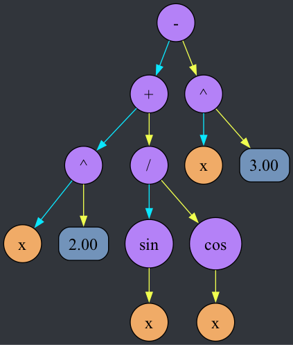
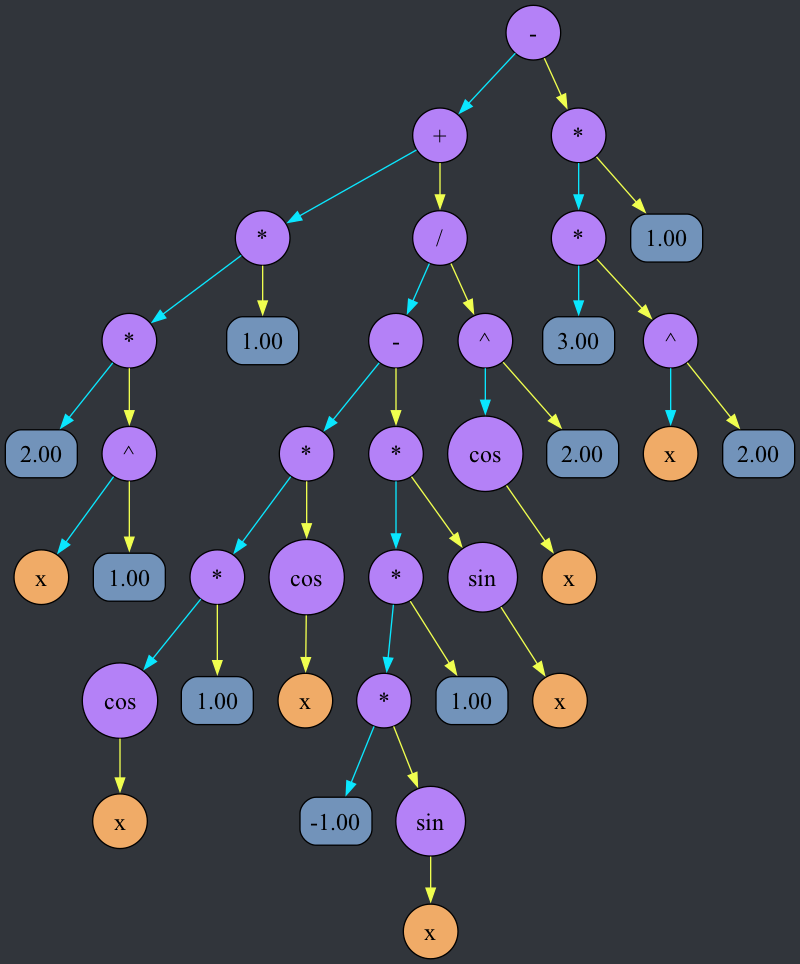
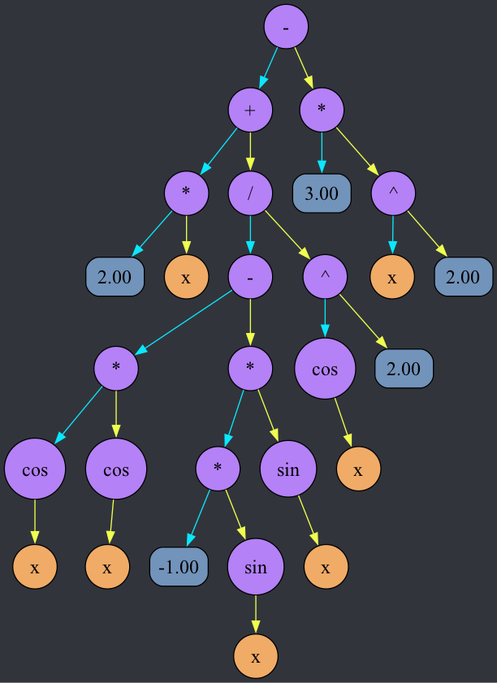

# Дифференциатор
Программа считывает математическое выражение используя алгоритм рекурсивного спуска в удобном для чтения и написания формате и преобразует его в дерево. После этого берется производная от этого выражения и строится ее дерево. Производная выводится в формате LaTeX.

## Доступные операции:
* Сложение: `+`
* Вычитание: `-`
* Умножение: `*`
* Деление: `/`
* Синус: `sin(x)`
* Косинус: `cos(x)`

Список доступных функций легко расширяем.

## Пример использования:
Ввод:  "x^2 + sin(x)/cos(x) - x^3"

Дерево выражения:

Дерево производной:

Дерево производной после упрощения: убираются выражения, умноженные на ноль, убираются вершины прибавляющие 0 или умножающие на 1

Вывод: $2*x+\frac{(\cos{x}*\cos{x}-(-1)*\sin{x}*\sin{x})}{\cos{x}^{2}}-3*x^{2}$
